# Infraestrutura de TIC do IFSC câmpus São José

A CTIC atualmente administra em sua infraestrutura:
* 14 Servidores físicos
* 3 Lâminas (_Blades_) HP BL465c-S em um _enclosure_ HP C7000
* _Storage_ EMC VNX 5300 com 7 barramentos e 125 discos
* 48 _Switches_ gerenciáveis (e outros não gerenciáveis)
* _Firewall_ PFSense com redundância ativa de _hardware_ via [CARP](https://docs.netgate.com/pfsense/en/latest/highavailability/index.html)
* 27 _APs_ Cisco séries 1600 e 2600
* 380 Computadores (gerenciados em [IaC](https://pt.wikipedia.org/wiki/Infraestrutura_como_C%C3%B3digo) [com Ansible](https://github.com/ctic-sje-ifsc/ansible))
* Central telefônica com aproximadamente 70 ramais
* +30 Servidores Virtuais ([página Web](http://sj.ifsc.edu.br), [wiki](http://wiki.sj.ifsc.edu.br), câmeras e outros)

**Obs.: Os acesso aos links do Netbox estão restritos a rede do IFSC.**

## Segurança e estabilidade da nossa rede hoje:

Possuímos redundância ativa no nosso _firewall_. Abordamos a alta disponibilidade do _firewall_ no próximo tópico com mais detalhe. Além disso, possuímos redundância passiva no nosso _core switch_. A figura a seguir ilustra isto:

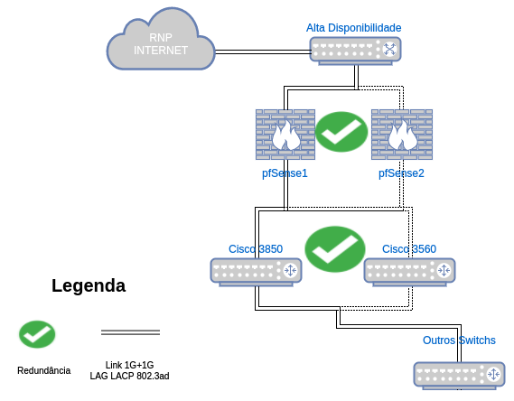

A rede está configurada na forma de anel no seu _core_, com redûndancia de caminho e de links (LACP). Os _racks_ de borda estão conectados com redundância de link aos _racks_ centrais. A rede é segmentada em [VLANs](https://netbox.sj.ifsc.edu.br/ipam/vlans/) e pussuímos política de acessos entre as VLANs (ACLs). Incluido nessas políticas possuímos bloqueios de propagação de DHCP indevido. Além disso, possuímos STP configurado em toda a rede.

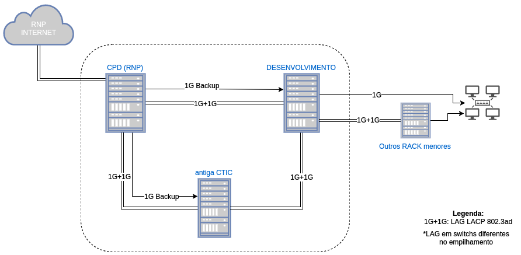


### _Firewall_ PFSense com Alta disponibilidade

A solução de _firewall_ que utilizamos é o [redundância ativa](https://doc.pfsense.org/index.php/High_Availability) no nosso _firewall_ via servidores físicos distintos. 

Essa demanda foi baseada no seguinte questionamento: "_E se/quando nosso firewall Cisco ASA queimar/dar problema?_". 
Dentro do IFSC alguns câmpus já utilizavam o PFSense como _firewall_ e com excelentes resultados. Com isso, primeiramente substituímos o firewall atual para o PFSense para poder implantar alta disponibilidade. Segue a descrição de _hardware_ dos dois servidores (ambos foram doados pela reitoria por estarem obsoletos):

* Master - IBM System x3200 M2:
  * Processador: Intel(R) Xeon(R) CPU X3320 @ 2.50GHz (4 CPUs: 1 package(s) x 4 core(s))
  * Memória: 8 GB
    * Load average: 0.30, 0.43, 0.37
    * CPU usage: 8%
    * Memory usage	6% of 8155 MiB

* Backup - IBM xSeries 206m: 
  * Processador: Intel(R) Pentium(R) D CPU 3.00GHz (2 CPUs: 1 package(s) x 2 core(s))
  * Memória 2 GB

Fizemos o [registro em vídeo](https://youtu.be/jkS7ZbTbtkA) da PoC de um possível problema com o _master firewall_:

-[](https://youtu.be/jkS7ZbTbtkA)

#### CARP Status - _Firewall_ pfSense mestre e escravo:

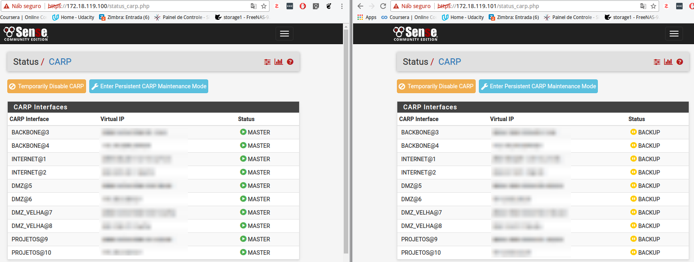


## Infraestrutura de _Data Center_:

### Hiperconvergência = Proxmox + Ceph (+ k8s):

Possuímos uma infraestrutura hiperconvergente (HCI), utilizando soluções definidas por _software_ (_Software Defined_ - SD), onde armazenamento, processamento e rede compartilham o mesmo _hardware_ de arquitetura amd64 padrão da indústria. Com isso alcançamos uma melhor eficiência e agilidade na gestão dos recursos de TIC.
A figura abaixo apresenta uma visão global da nossa infraestrutura :

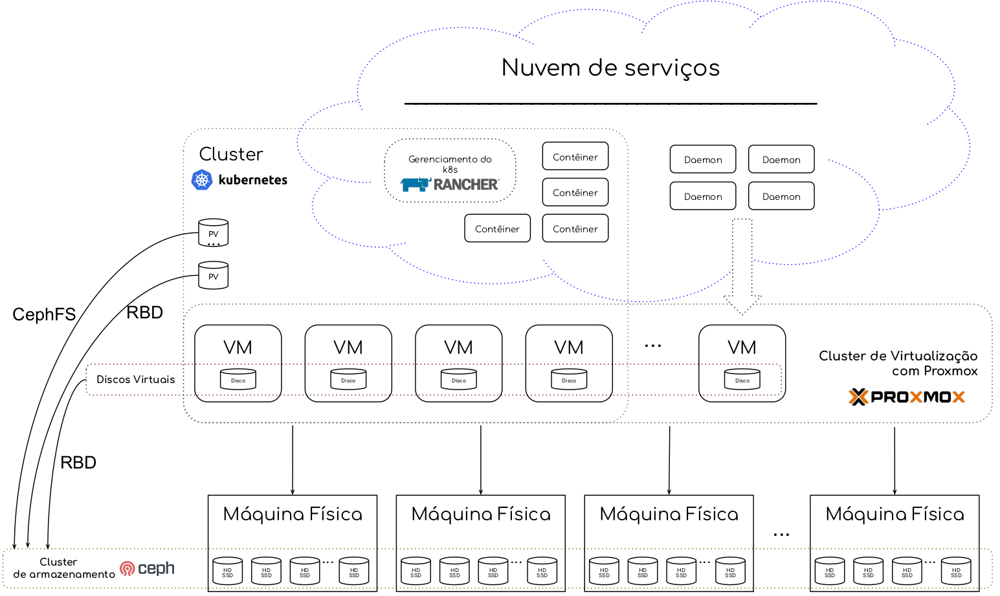

Cada máquina física possui discos que fazem parte do _cluster_ de armazenamento distribuído realizado pela ferramenta [Ceph](https://docs.ceph.com/docs/master/start/intro/). As mesmas máquinas físicas fazem parte de um _cluster_ de virtualização por meio da ferramenta [Proxmox](https://www.proxmox.com/en/proxmox-ve), possibilitando alta disponibilidade de máquinas virtuais, migração a quente, entre outros. Os discos utilizados pelas VMs são providos pelo _cluster_ de armazenamento, mais especificamente um [dispositivo de bloco do Ceph](https://docs.ceph.com/docs/master/rbd/). Fazemos backup completos semanais das VMs no nosso _storage_ diretamente pelo serviço provido pelo Proxmox.

## _Cluster_ de armazenamento - Ceph

Utilizamos a implementação de [Ceph integrada do Proxmox](https://pve.proxmox.com/pve-docs/chapter-pveceph.html).
O [CRUSH map](https://docs.ceph.com/docs/jewel/rados/operations/crush-map/) foi configurado de modo a implementar um domínio de falha com o agrupamento de servidores do tipo _blade_ que fazem parte do mesmo chassi. Assim, é garantido que as réplicas de dados não fiquem todas no mesmo domínio de falha, e caso ocorra problema em alguma _blade_ (os nos seus discos mapeados do _storage_) não haverá perda de dados e indisponibilidade dos serviços.
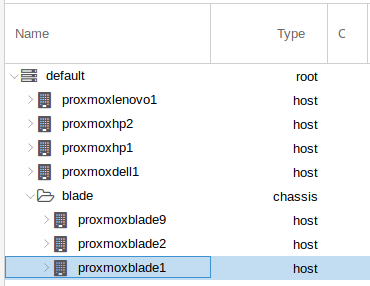


## _Cluster_ de Virtualização - Proxmox

O cluster de virtualização foi criado a partir de máquinas com o Proxmox, sendo esse instalado seguindo a [documentação de cluster do Proxmox](https://pve.proxmox.com/pve-docs/chapter-pvecm.html).

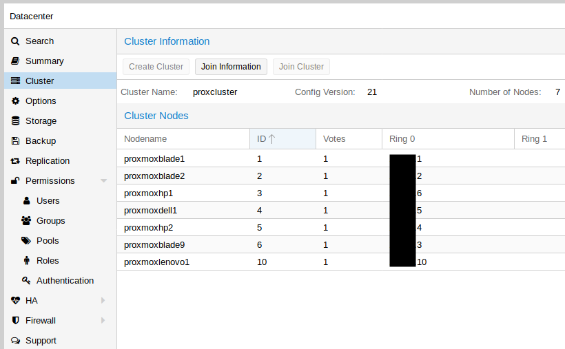

A figura a seguir representa um exemplo da configuração de rede de uma máquina para fazer parte do _cluster_. É possível verificar em especial: a agregação de enlace (bond0), a rede do _cluster_, SAN e Ceph.

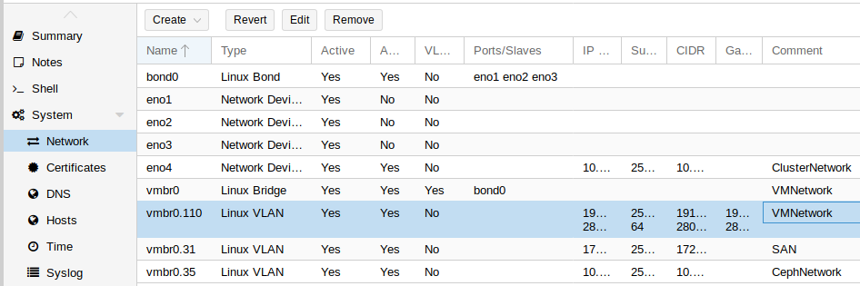

Os recursos (CPU, Memória e Armazenamento) são agrupados no _cluster_ de virtualização conforme ilustrado a seguir:

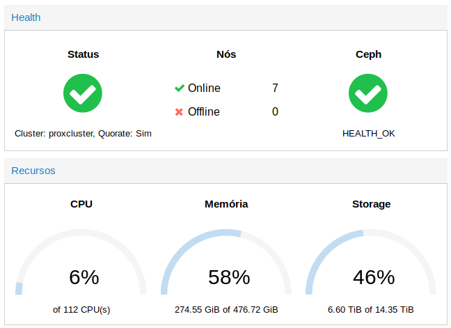

O armazenamento utilizado pelo _cluster_ de virtualização (discos de VM, _snapshots_, ISOs etc.) é fornecido pelo [Cluster de armazenamento Ceph](#cluster-de-armazenamento-ceph). A figura a seguir ilustra os "_storages_": `cephfs` ([CephFS](https://docs.ceph.com/docs/master/cephfs/)) e Storage_Ceph ([RBD](https://docs.ceph.com/docs/master/rbd/)) disponíveis para uso: 

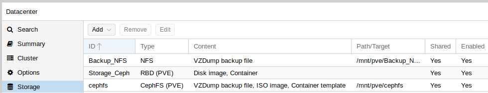

O "_storage_" `Backup_NFS` é um armazenamento do tipo NFS, provido por uma das máquinas conectado ao nosso _storage_ (físico), onde fazemos os _full backups_ das VMs semanalmente.

O [cluster possui a configuração](https://pve.proxmox.com/pve-docs/chapter-ha-manager.html) para fornecer **alta disponibilidade**  nas VMs:

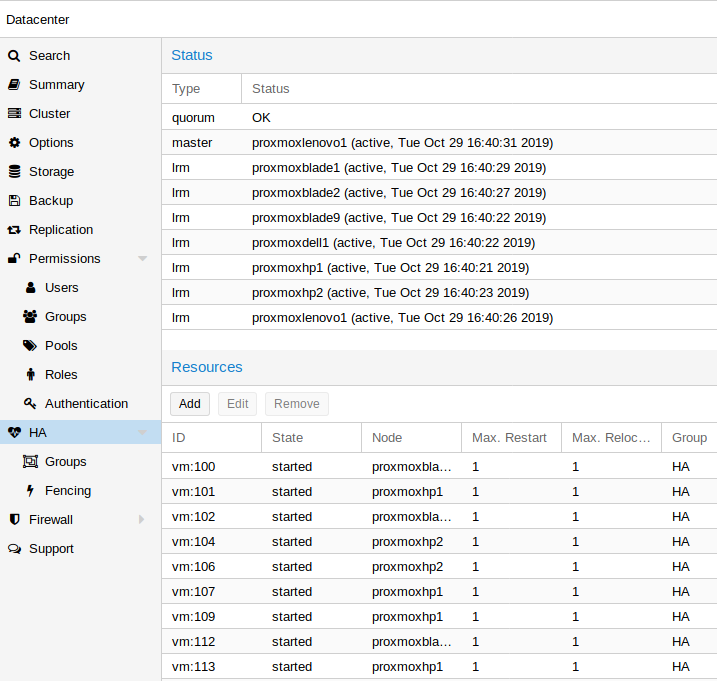'


## "_Cluster_ de Contêiner" / Nuvem privada - Kubernetes + Rancher

Um conjunto de máquinas virtuais compõem um "_cluster_ de Contêiner", para isso utilizamos o [Kubernetes](https://kubernetes.io/pt/) como orquestrador. O gerenciamento do _cluster_ Kubernetes, em especial a parte de autenticação e autorização, é realizado pelo [Rancher](https://rancher.com/products/rancher). A seguir uma tela da interface do Rancher.

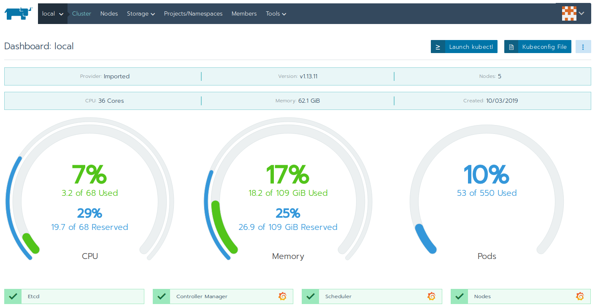

As VMs que fazem parte do _cluster_ são criadas a partir de um [modelo de VM](https://pve.proxmox.com/wiki/VM_Templates_and_Clones) configurado com [cloud init](https://pve.proxmox.com/wiki/Cloud-Init_Support). Os [requisitos de configuração e dependências](https://rancher.com/docs/rke/latest/en/os/) são aplicados nas VMs a partir da ferramenta Ansible a partir do repositório [ansible](https://github.com/ctic-sje-ifsc/ansible/blob/master/servidores/vms_nuvem.yml). 

Com os requisitos e configurações aplicados é utilizado a ferramenta [rke](https://rancher.com/docs/rke/latest/en/) para fazer a criação e gestão do _cluster_ Kubernetes, como descrito no repositório [cluster_k8s_rke](https://github.com/ctic-sje-ifsc/cluster_k8s_rke).

## Armazenamento persistente para os serviços na nuvem k8s

Utilizamos atualmente 4 tipos de [armazenamento persistente](https://kubernetes.io/docs/concepts/storage/persistent-volumes/): `cephfs`, `rbd`, ISCSI e NFS. Abaixo podemos ver exemplos de utilização de cada um nos nossos serviços.

```yaml
apiVersion: v1
kind: PersistentVolume
metadata:
  name: fogproject-mysql
spec:
  capacity:
    storage: 2Gi
  accessModes:
    - ReadWriteOnce
  storageClassName: fogproject-mysql
  cephfs:
    monitors:
    - 10.10.10.1:6789
    - 10.10.10.5:6789
    - 10.10.10.6:6789
    path: /kubernetes/ifsc/sje/srv/fog/data/mysql
    user: admin
    secretRef:
      name: ceph-secret

[...]

  rbd:
    monitors:
    - 10.10.10.1:6789
    - 10.10.10.5:6789
    - 10.10.10.6:6789
    pool: kube
    image: quartus
    fsType: ext4
    readOnly: false
    user: admin
    secretRef:
      name: ceph-secret-rbd

[...]

  iscsi:
    targetPortal: 172.18.31.1:3260
    iscsiInterface: default 
    iqn: iqn.1992-04.com.emc:cx.ckm00123700157.a4
    lun: 0
    initiatorName: iqn.2019-06.pv-bareos-sd-continente:00:2955d7e72762
    fsType: ext4
    readOnly: false
    chapAuthDiscovery: true
    chapAuthSession: true
    secretRef:
      name: chap-secret-pv-bareos-sd
  storageClassName: pv-bareos-sd-continente-bkp

[...]

  mountOptions:
    - nolock
    - nfsvers=3
  nfs:
    server: 191.36.8.71
    path: /nfs_kubernetes/kubernetes/ifsc/sje/a/home

```
